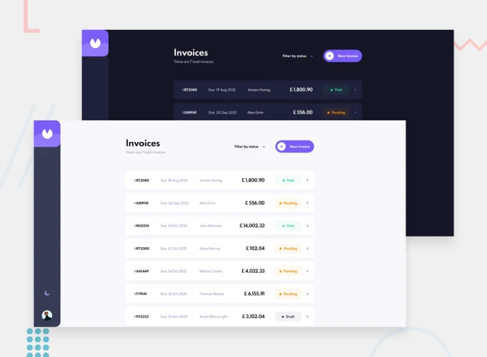
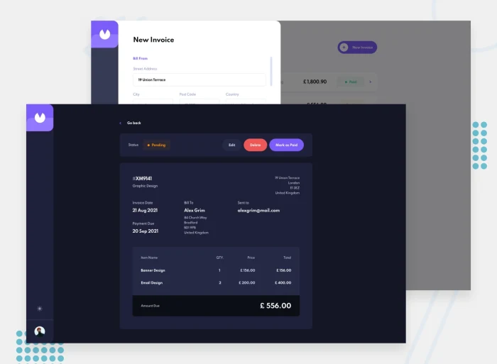

# Frontend Mentor - Invoice web app solution

This is a solution to the [Invoice web app challenge on Frontend Mentor](https://www.frontendmentor.io/challenges/invoice-app-i7KaLTQjl). Frontend Mentor challenges help you improve your coding skills by building realistic projects.

## Table of contents

- [Overview](#overview)
  - [The challenge](#the-challenge)
  - [Screenshot](#screenshot)
  - [Links](#links)
  - [Built with](#built-with)
  - [Useful resources](#useful-resources)
  -[Whar I Learned](#what-i-learned)
- [Author](#author)

## Overview

### The challenge

Users should be able to:

- View the optimal layout for the app depending on their device's screen size
- See hover states for all interactive elements on the page
- Create, read, update, and delete invoices
- Receive form validations when trying to create/edit an invoice
- Save draft invoices, and mark pending invoices as paid
- Filter invoices by status (draft/pending/paid)
- Toggle light and dark mode
- **Bonus**: Keep track of any changes, even after refreshing the browser (`localStorage` could be used for this if you're not building out a full-stack app)

### Screenshot

### Links

- Live Site URL: [link](https://invoice-web-app-react.vercel.app/)

### Built with

- [TailwindCSS](https://tailwindcss.com/) - CSS Framework
- [React](https://reactjs.org/) - JS library
- [React Router](https://reactrouter.com/) - Routing
- [Framer Motion](https://www.framer.com/motion/) - React Animation Library

### What I learned

In this project, I learned how to work with libraries like React, Redux Toolkit, Framer Motion, and Moment.js. I also gained experience in building web applications, implementing features like data fetching, form submission, routing, and animations. Additionally, I learned about best practices for structuring and organizing code, as well as working with json files and managing state using Redux Toolkit.

I learned how to work with the Framer Motion library. Prior to this project, I had no experience working with Framer Motion, but through this project, I gained experience in this area.

### Useful resources
- [Framer Motion Documents](https://www.framer.com/motion/introduction/)

## Author

- LinkedIn - [Hesam DearBoy](https://www.linkedin.com/in/hesam-azizpour-23259b265/)

